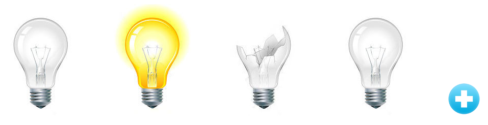

# broken-light-bulbs.
 Lampadas Quebradas.
 [Acesse aqui broken-light-bulbs](https://paulovitorguedes-broken-light-bulbs.netlify.app/)
#### Projeto em *HTML* e *JAVASCRIPT*

 - A página inicia-se com apenas uma lâmpada.
 - O icone ( + ) adiciona novas lâmpadas à Página, não há limites de lâmpadas.
 - Na presença do mouse, a lâmpada selecionada acenderá.
 - A ausência do mouse, a lâmpada selecionada será apagada.
 - Com um clique do mouse, a lâmpada selecionada será quebrada.
 - Após a lâmpada quebrada não será mais possível o retorno do estado inicial.